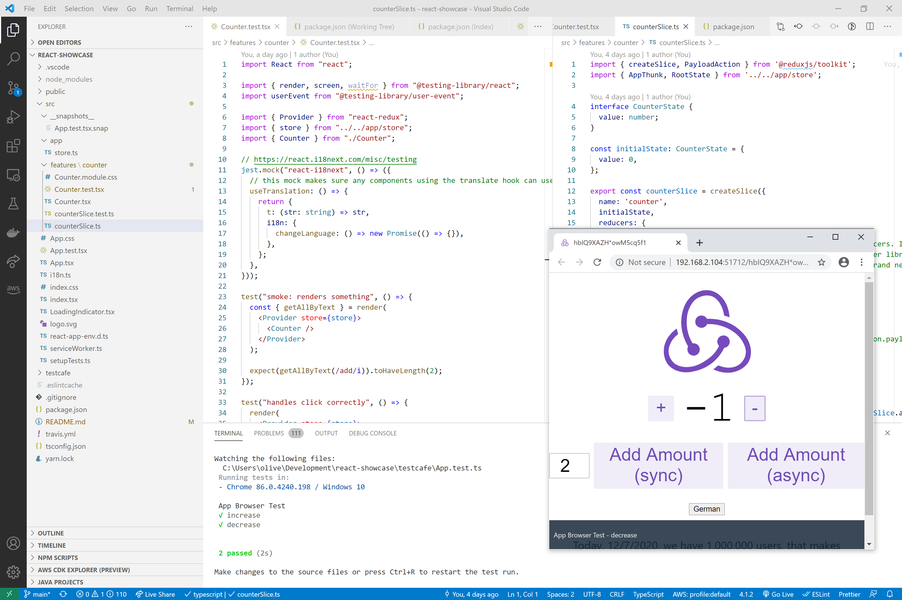
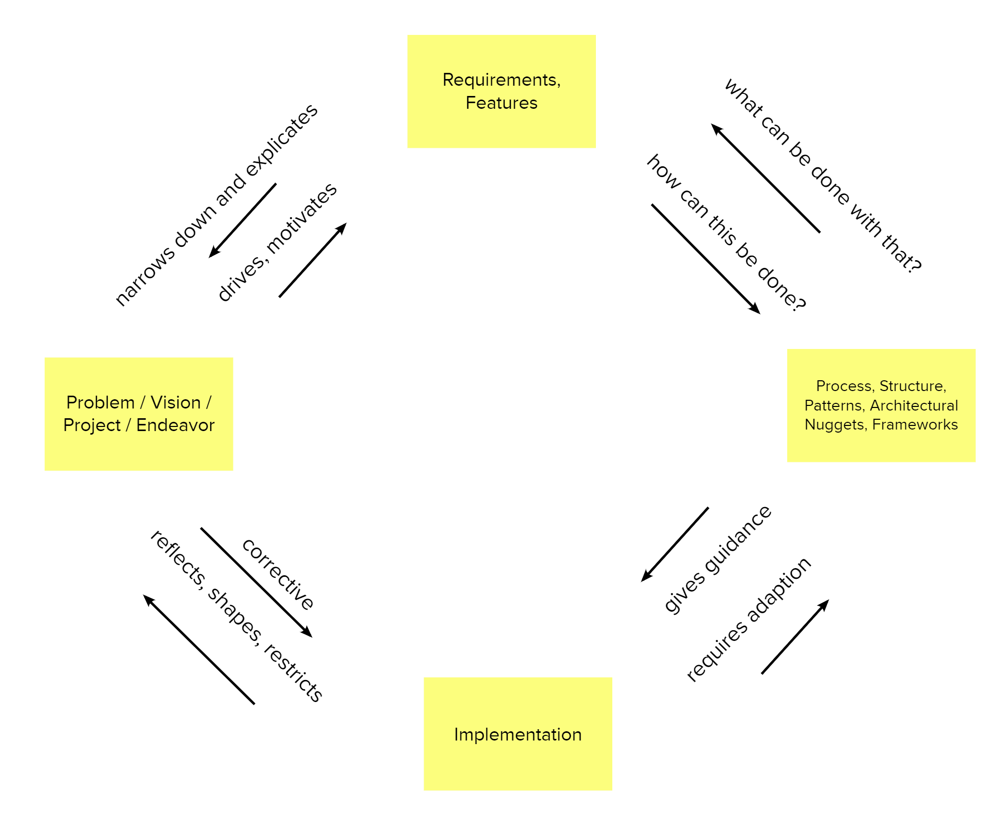

# Showcase: React for business applications

__Given the typical technical and structural requirements of a business application what are the recommended technology choices and architectural nuggets?__

## Architecture / Tech

This is my recommended tech stack for a typical enterprise application. Underlying assumptions of most important requirements
- Long service life (often more than 10 years) and thus good maintainability
- Development with several teams and members changing over the years 
- Good structuring possibilities for large and complex applications 
- Fast development speed

http://blog.embarc.de/spicker/#9

## Is architecture just clueless talking and useless Visios?

Architecture is the sum of the important Processes, Structures, Patterns, Architectural Nuggets and Frameworks. Important can mean 
* _hard to change, but somewhat risky_, 
* _affecting many teams/people or large parts of the software_, 
* _restricting what can be built reasonably_, 
* _having the potential to make the endeavor fail_. 

Idea of Architectural Nuggets taken from: https://pkruchten.files.wordpress.com/2020/06/kruchten-2020-northrop-award.pdf

Also from Kruchten: _The life of a software architect is a long and sometimes
painful succession of suboptimal decisions taken partly in the dark._

Definition of architecture inspired by: https://martinfowler.com/architecture/

## Most important Architectural decisions

### Framework
- https://2020.stateofjs.com/en-US/technologies/front-end-frameworks/
- https://tsh.io/state-of-frontend/#frameworks
- https://medium.com/javascript-in-plain-english/javascript-frameworks-performance-comparison-2020-cd881ac21fce
- https://djcordhose.github.io/spa-workshop/2020_arch.html#/frameworks
- https://reactjs.org/

### Typing
- https://2020.stateofjs.com/en-US/technologies/javascript-flavors/
- https://djcordhose.github.io/spa-workshop/2020_arch.html#/ts
- https://djcordhose.github.io/spa-workshop/2020_js_ts_intro.html#/ts
- https://www.typescriptlang.org/
- https://www.typescriptlang.org/docs/handbook/react.html
- https://react-typescript-cheatsheet.netlify.app/
- https://github.com/piotrwitek/react-redux-typescript-guide#react--redux-in-typescript---complete-guide
- Advise
  - Don't overdo it
    - You can go a long way, but you probably shouldn't: https://github.com/gcanti/fp-ts
  - Libraries (shared code, also completely internal) can benefit from a lot of typing
  - Application code mainly benefits from typing
    - Often simply making a component TS can bring a huge benefit without adding any type information at all
- Type vs Interface: https://nilshartmann.github.io/typescript-intro/2021_js_ts.html#type-vs-interface

### State Management
- https://2020.stateofjs.com/en-US/technologies/datalayer/
- https://djcordhose.github.io/spa-workshop/2020_arch.html#/innere-struktur
- https://djcordhose.github.io/spa-workshop/2020_arch.html#/state-management
- https://nilshartmann.github.io/react-training/2020_1211_react.html#/t-state
- Redux
  - https://redux.js.org/
  - https://redux-toolkit.js.org/
    - Motivation
      - "Configuring a Redux store is too complicated"
      - "I have to add a lot of packages to get Redux to do anything useful"
      - "Redux requires too much boilerplate code"
    - https://redux-toolkit.js.org/usage/usage-with-typescript
    - https://redux.js.org/faq/code-structure#how-should-i-split-my-logic-between-reducers-and-action-creators-where-should-my-business-logic-go
      - "Find the balance between these two extremes, and you will master Redux."
    - Effects ngrx-style: https://github.com/davidkpiano/useEffectReducer
- MobX
  - https://mobx.js.org/react-integration.html
  - https://michel.codes/blogs/mobx6
  - https://nilshartmann.github.io/react-training/2020_1211_react.html#/t-mobx
- XState
  - https://github.com/davidkpiano/xstate
  - https://github.com/davidkpiano/xstate/tree/master/packages/xstate-react
  - https://codesandbox.io/s/xstate-react-typescript-template-wjdvn?file=/src/index.tsx
- Comparison based on single/multi and direct/indirect: https://twitter.com/DavidKPiano/status/1353712136372039682
  - "state management is the wild west and the categories aren't mutually exclusive (and can become each other with abstractions/convention), so it's a rough categorization"
  
### Micro-Frontends
- https://micro-frontends.org/
- https://the-tractor.store/
  - https://github.com/naltatis/micro-frontends-in-action-code
- Server-Side Integration
  - SSI (Server-Side Include): http://nginx.org/en/docs/http/ngx_http_ssi_module.html 
  - Pure Verticals: Separate apps using classic links
- Client-Side Integration
  - iFrame: https://developer.mozilla.org/en-US/docs/Web/HTML/Element/iframe
  - WebComponent: https://developer.mozilla.org/en-US/docs/Web/Web_Components
  - AppShell: https://developers.google.com/web/fundamentals/architecture/app-shell
  - Modular Monolith
    - Development in a monorepo
      - https://lerna.js.org/
      - https://classic.yarnpkg.com/en/docs/workspaces/
    - Code Splitting: 
      - https://create-react-app.dev/docs/code-splitting
      - https://reactjs.org/docs/code-splitting.html#route-based-code-splitting

### Structure within a module
- Smart Components: `Counter.tsx`
- Dumb Components: `AriaButton.tsx`
- http://blog.embarc.de/spicker/#9

### Testing

We have dedicated a whole document to this topic: testing.md

## Less important technical recommendations
### Dependency Management
- https://classic.yarnpkg.com/en/

### Linting
- https://eslint.org/
- TypeScript can also be used as a linter

### Routing
- https://github.com/ReactTraining/react-router
- Routing and Redux
  - Deprecated: https://github.com/reactjs/react-router-redux
  - "official" answer - don't: https://stackoverflow.com/questions/36722584/how-to-sync-redux-state-and-url-hash-tag-params/36749963#36749963

### i18n, l10n
- https://react.i18next.com/
  - https://www.i18next.com/translation-function/interpolation
  - https://github.com/i18next/react-i18next
  - https://developer.mozilla.org/en-US/docs/Web/JavaScript/Reference/Global_Objects/Intl
- Deprecated
  - https://momentjs.com/
  - http://numeraljs.com/

### Build / Deployment
- `yarn build`
- https://create-react-app.dev/docs/deployment/ 
- https://create-react-app.dev/docs/deployment/#github-pages

### Component Libraries
- https://material-ui.com/
- https://github.com/microsoft/fluentui
- Build your own 
  - https://classic.yarnpkg.com/en/docs/workspaces/
  - https://lerna.js.org/
  - https://blog.harveydelaney.com/creating-your-own-react-component-library/
  -  modes of maintenance
     1. corporate: use is mandatory for all, high risk in quality and suitability of lib
     2. agile: use recommended, usage shows quality and suitability of lib
  -  ownership?
  -  What to publish?
     - modules referenced via "exports" can include modern syntax: https://twitter.com/_developit/status/1347296236282523648

### CSS Framework
- https://tailwindcss.com
  - https://marketplace.visualstudio.com/items?itemName=bradlc.vscode-tailwindcss
  - https://tailwindcss.com/docs/optimizing-for-production

## Create React App

This project was bootstrapped with [Create React App](https://github.com/facebook/create-react-app), using the [Redux](https://redux.js.org/) and [Redux Toolkit](https://redux-toolkit.js.org/) template.

### Creation
- https://github.com/reduxjs/cra-template-redux-typescript
  - yarn create react-app my-app --template redux-typescript
- yarn upgrade typescript --latest

In the project directory, you can run:

### `yarn start`

Runs the app in the development mode. 
Open [http://localhost:3000](http://localhost:3000) to view it in the browser.

The page will reload if you make edits. 
You will also see any lint errors in the console.

### `yarn test`

Launches the test runner in the interactive watch mode. 
See the section about [running tests](https://facebook.github.io/create-react-app/docs/running-tests) for more information.

### `yarn build`

Builds the app for production to the `build` folder. 
It correctly bundles React in production mode and optimizes the build for the best performance.

The build is minified and the filenames include the hashes. 
Your app is ready to be deployed!

See the section about [deployment](https://facebook.github.io/create-react-app/docs/deployment) for more information.

### `yarn eject`

**Note: this is a one-way operation. Once you `eject`, you can’t go back!**

If you aren’t satisfied with the build tool and configuration choices, you can `eject` at any time. This command will remove the single build dependency from your project.

Instead, it will copy all the configuration files and the transitive dependencies (webpack, Babel, ESLint, etc) right into your project so you have full control over them. All of the commands except `eject` will still work, but they will point to the copied scripts so you can tweak them. At this point you’re on your own.

You don’t have to ever use `eject`. The curated feature set is suitable for small and middle deployments, and you shouldn’t feel obligated to use this feature. However we understand that this tool wouldn’t be useful if you couldn’t customize it when you are ready for it.

## Learn More

You can learn more in the [Create React App documentation](https://facebook.github.io/create-react-app/docs/getting-started).

To learn React, check out the [React documentation](https://reactjs.org/).
